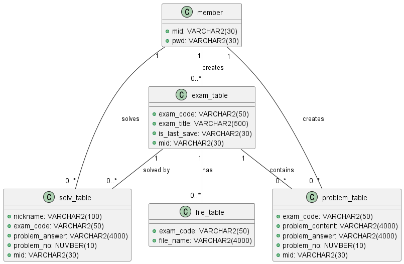
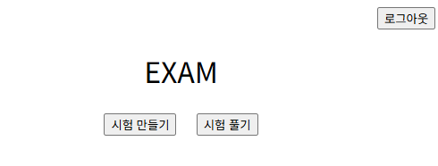
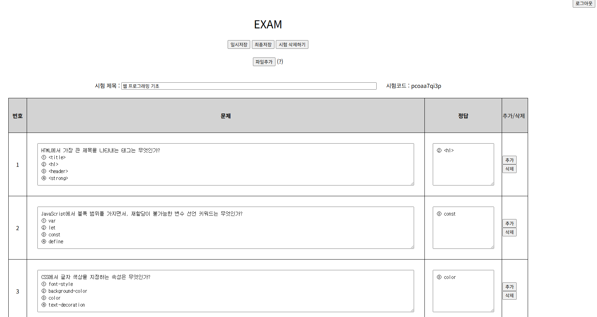
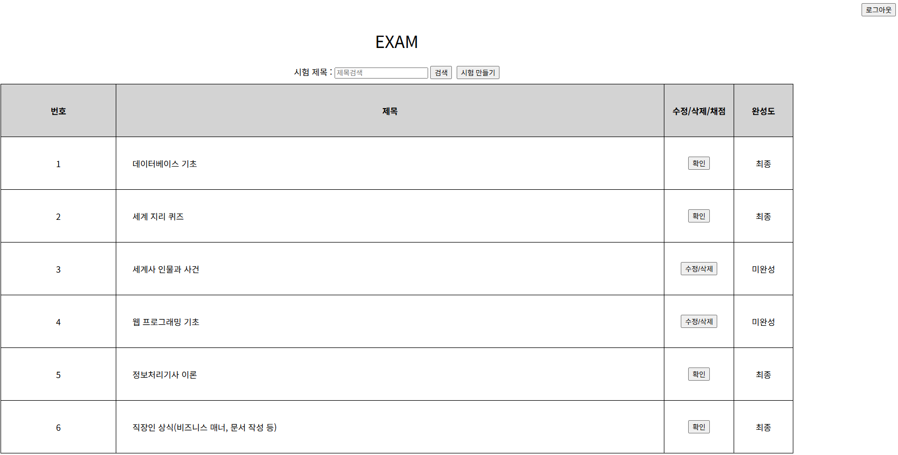
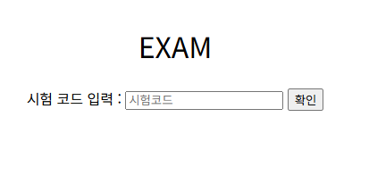
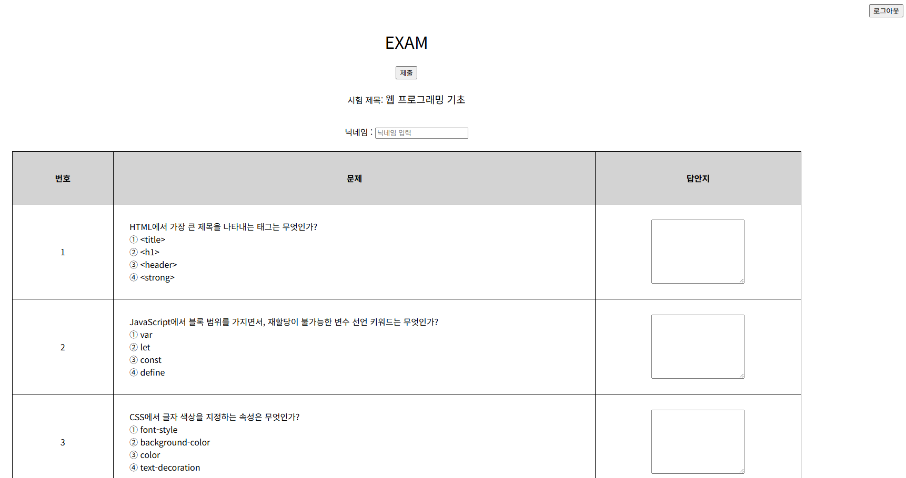
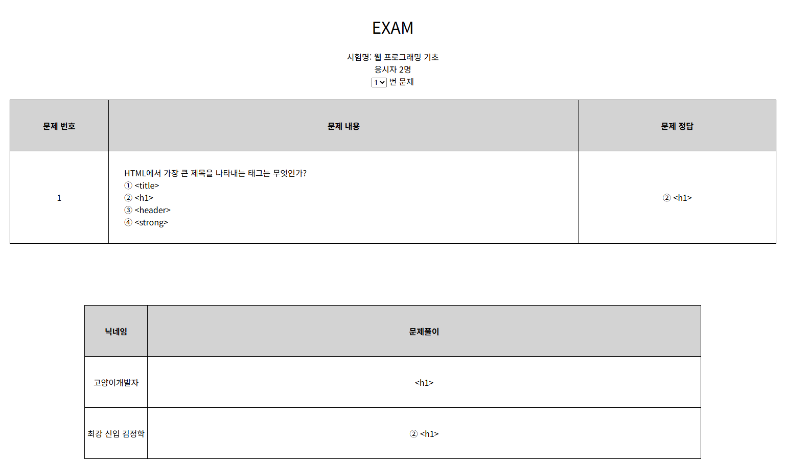

## 시험 출제 사이트
간단하게 시험을 출제하고 푸는 사이트

## 개인 프로젝트

## 개발 기간
- 2024.01.22 ~ 2024.28 (7일)

## 기술 스택
- 프레임워크: Spring Framework
- 언어: Java, JavaScript, HTML, CSS
- DB: Oracle
- UI 라이브러리: jQuery
- 빌드 도구: Gradle

## 주요 기능
- 시험 출제 - 문제 제작 및 배포
- 시험 풀기 - 문제 풀기

## 클래스 다이어그램
 
 

## 프로젝트 화면
### 메인
 
 
### 시험 문제 작성
 
 
### 시험 검색
 
 
### 시험코드입력
 
 
### 시험 풀기
 
 
### 채점
 
 

## 문제점 및 해결방안
### 작품 개발 측면
부트캠프 종료 이후 첫 개인 프로젝트입니다.  
전체적인 설계 및 구조 잡는 과정이 미숙했습니다.  
오로지 혼자 해야했기 때문에 스스로 생각하면서 구조를 설계해야 했습니다.  

### 해결 방안
작업할 내용을 A4용지에 정리했습니다.
코드 흐름의 구조를 시각화하고 시뮬레이션을 하여 개발의 효율을 높였습니다.
MVC 패턴을 적용하여 Controller, Service, DAO를 구분하고, MyBatis를 활용해 DB 접근 로직을 단순화했습니다.